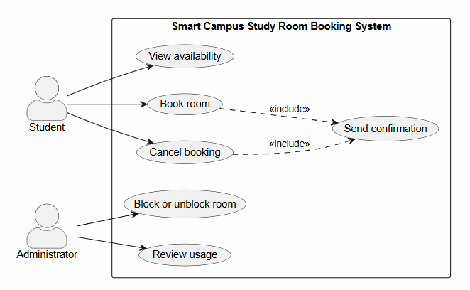

# Lab report — Practice #03, Requirements Engineering with AI

Fill in every section. **Do not delete or renumber the headings** — the README points at them and a
missing heading reads as a missing section.

Name: Amal
Student ID: 24B031961
GitHub username: aosmanovv

---

## 1. Setup

| |           |
| --- |-----------|
| AI assistant (tool) | Claude    |
| Exact model name and version | Sonnet 5 Medium |
| Date of the session | 26.09.26  |
| Diagram renderer used |  PlantUML online server (plantuml.com) |

One tool and one model for all three prompts. If you switched, say why here — it changes what your
findings mean.

---

## 2. Original AI output — user stories (Part 1)

Paste the **unedited** response to Prompt 1. Do not tidy it. If it is long, paste all of it anyway;
this is the baseline everything else is measured against.

```
**Smart Campus Study Room Booking: User Stories**

**Student stories**

**US-1: Search for available rooms**
As a student, I want to search for study rooms by date, time, capacity, and equipment, so that I can quickly find a room that suits my group's needs.
- Priority: High
- Assumption: Room availability data is kept current in real time by the booking system.

**US-2: Book a room**
As a student, I want to reserve an available study room for a specific time slot, so that I am guaranteed a place to study.
- Priority: High
- Assumption: Students log in with their existing campus credentials to make a booking.

**US-3: Cancel or modify a booking**
As a student, I want to cancel or change my reservation, so that unused rooms are released for others when my plans change.
- Priority: Medium
- Assumption: Cancellations are allowed up to a set deadline before the booking start time.

**US-4: Receive confirmation and reminders**
As a student, I want to receive a confirmation and a reminder before my booking, so that I do not forget or miss my reserved slot.
- Priority: Medium
- Assumption: Every student account has a verified email address or app notification enabled.

**Administrator stories**

**US-5: Manage rooms and availability**
As an administrator, I want to add, edit, or temporarily close study rooms, so that the system reflects actual room availability, including maintenance periods.
- Priority: High
- Assumption: Administrators have role-based access separate from student accounts.

**US-6: Set and enforce booking rules**
As an administrator, I want to configure rules such as maximum booking duration and limits per student, so that rooms are shared fairly across the campus.
- Priority: High
- Assumption: Rule values are decided by university policy and can be changed without code changes.

**US-7: View and override bookings**
As an administrator, I want to view all bookings and cancel or reassign them when necessary, so that I can resolve conflicts or handle urgent campus events.
- Priority: Medium
- Assumption: Affected students are automatically notified when an administrator overrides their booking.

**US-8: Generate usage reports**
As an administrator, I want to see reports on room usage and no-show rates, so that I can make informed decisions about room allocation and policy.
- Priority: Low
- Assumption: The system records check-in or attendance data, or at least booking history, to base reports on.
```

---

## 3. Story review (Part 2) ##

| Story (as generated) | What I did | Why                                                                                                                                                                                                                                                                                                                      | Final ID |
| --- | --- |--------------------------------------------------------------------------------------------------------------------------------------------------------------------------------------------------------------------------------------------------------------------------------------------------------------------------| --- |
| US-1 Search rooms by date, time, capacity, equipment | Rewrote | The equipment filter was not part of the scenario.                                                                                                                                                                                                                                                                       | US-01 |
| US-2 Book a room | Kept unchanged | Names a real stakeholder (Student), describes one outcome, the reason explains the value, and it is small and testable on its own.                                                                                                                                                                                       | US-02 |
| US-3 Cancel or modify a booking | Rewrote | Two outcomes bundled into one story. "Modify" is a bigger change (effectively cancel+rebook under R1–R4) and belongs in its own iteration.                                                                                                                                                                               | US-03 |
| US-4 Confirmation and reminders | Deleted | Reminders/notifications are explicitly out of scope                                                                                                                                                                                                                                                                      | none |
| US-5 Manage rooms and availability (add, edit, close) | Rewrote, then split into two | First pass just split by outcome (testability), but that missed the real problem: "add/edit" a room is not one of the six fixed use cases - only *block/unblock* (UC-04) exists. Narrowed to blocking and unblocking only, as two separate stories.                                                                      | US-04, US-05 |
| US-6 Set and enforce booking rules (max duration and per-student limits) | Rewrote | Two rules bundled, and per-student limits aren't among R1-R4. Also "set" implied the 2-hour cap is admin-configurable, but R2 fixes it as non-negotiable for everyone, so this isn't an Administrator action at all.              | US-06 |
| US-7 View and override bookings (with reassign, auto-notify) | Rewrote (view and cancel only) | Three outcomes in one story. "Reassign" is not one of the six use cases, and the auto-notify assumption duplicates the out-of-scope notification item.                                                                                                                                                                   | US-07 |
| US-8 Usage reports and no-show rates | Deleted | No-show tracking is attendance-tracking under another name ("check-in, attendance or QR codes") | none |

 **Did the assistant invent anything outside the scenario?**: 

 Yes, in five places, checked against the out-of-scope:
- US-1's equipment filter - not literally "equipment...requests," but introduces a room attribute the scenario never defines, which is the same kind of unrequested scope.
- US-4's reminders/notifications - exact match: "SMS, push or reminder notifications of any kind beyond UC-06."
- US-5's "add/edit a room" - not on the explicit bullet list, but violates "exactly six functions": there is no room-creation/editing use case, only block/unblock.
- US-6's per-student limit - not on the bullet list, but violates "four, not negotiable" business rules (R1-R4 only).
- US-7's reassign + auto-notify - reassign is not one of the six use cases; auto-notify duplicates the notifications item.
- US-8's no-show tracking - matches "check-in, attendance or QR codes."

**How many stories did you end with, and why that number?** 
8 (US-01–US-08). Started from 8 generated: 
2 deleted outright (US-4, US-8),
1 split into 2 after trimming an invented sub-feature 
(US-5 → US-04, US-05) - 7 total. During diagram review 
(Part 4), the actor table and the 
justified Admin→Review usage association showed Review 
usage is a genuine Administrator goal, unlike 
Send confirmation — so US-08 was added to close that gap 
rather than leave it undocumented. Net: 8 − 2 + 1 + 1 = 8, 
inside the 6–8 range. Only UC-06 (Send confirmation) 
ends with no story behind it -
a system-triggered side effect, not an actor goal.
---

## 4. Original AI output — acceptance criteria (Part 3) ##

```
## Assumptions

**Applies to all stories**
- All times are in the campus's local time zone. Examples assume the current time is **Mon 28 Sep 2026, 10:00**.
- A booking has a start time, an end time, a room, and the student who made it.
- A slot is written as start–end, for example 14:00–15:00.

**US-02 Book a room**
- "In the future" means the start time is strictly after the current time. A booking that starts now or earlier is rejected.
- The end time must be after the start time.
- The duration can be at most 2 hours. A booking of exactly 2 hours is accepted.
- Two slots overlap if one starts before the other ends. A slot that starts exactly when another ends is not an overlap.
- Cancelled bookings do not count when checking for overlaps.
- A rejected booking creates nothing, and the student sees the reason it was rejected.

**US-03 Cancel a booking**
- Cancelling a booking frees its slot straight away, so other students can book it.
- Once a booking's start time is reached, it is treated as started and can no longer be cancelled.

**US-04 Block a room**
- Only Administrators can block a room.
- A block stays in place until an Administrator unblocks the room.
- When a room is blocked, its future bookings are cancelled and the students who made them are notified. The story does not say what happens to these bookings, so this needs to be confirmed with the product owner.

---

## US-02: Book a free room

**AC1: Successful booking**
Given Room A is not blocked and has no bookings on 29 Sep
When a student requests Room A for 29 Sep, 14:00–15:30
Then the booking is created for that student
And Room A shows as booked for 29 Sep, 14:00–15:30

**AC2: Start time not in the future**
Given the current time is 28 Sep, 10:00
When a student requests Room A for 28 Sep, 09:00–10:00
Then the booking is rejected with the message "Bookings must start in the future"
And no booking is created

**AC3: Duration over 2 hours**
Given Room A is free on 29 Sep
When a student requests Room A for 29 Sep, 14:00–16:30
Then the booking is rejected with the message "Bookings cannot exceed 2 hours"
And a request for 14:00–16:00 (exactly 2 hours) would be accepted

**AC4: Overlap and back-to-back slots**
Given Room A has a booking on 29 Sep, 14:00–15:00
When a student requests Room A for 29 Sep, 14:30–15:30
Then the booking is rejected with the message "This room is already booked for part of that time"
And a request for 15:00–16:00 is accepted, because it starts exactly when the existing booking ends

**AC5: Blocked room**
Given Room B is blocked by an Administrator
When a student requests Room B for 29 Sep, 14:00–15:00
Then the booking is rejected with the message "This room is out of service and cannot be booked"
And no booking is created

---

## US-03: Cancel a booking

**AC1: Successful cancellation**
Given Student S1 has a booking for Room A on 29 Sep, 14:00–15:00
When S1 cancels that booking on 28 Sep, 10:00
Then the booking status changes to Cancelled
And Room A becomes free for 29 Sep, 14:00–15:00, so another student can book it

**AC2: Someone else's booking**
Given Student S2 has a booking for Room A on 29 Sep, 14:00–15:00
When Student S1 tries to cancel S2's booking
Then the cancellation is rejected with the message "You can only cancel your own bookings"
And S2's booking stays active

**AC3: Booking has already started**
Given S1 has a booking for Room A on 28 Sep, 09:30–11:00, and the current time is 28 Sep, 10:00
When S1 tries to cancel that booking
Then the cancellation is rejected with the message "Bookings can only be cancelled before they start"
And the booking stays active

**AC4: Booking already cancelled**
Given S1's booking for 29 Sep, 14:00–15:00 has already been cancelled
When S1 tries to cancel it again
Then the system tells S1 "This booking is already cancelled"
And nothing else changes

---

## US-04: Block a room

**AC1: Block a room that has no bookings**
Given Room B is available and has no future bookings
When an Administrator blocks Room B
Then Room B's status changes to Blocked
And Room B shows as unavailable to students

**AC2: Block a room that has bookings**
Given Room A has future bookings for 29 Sep, 14:00–15:00 (S1) and 30 Sep, 09:00–10:00 (S2)
When an Administrator blocks Room A
Then the block is applied
And both bookings are cancelled
And S1 and S2 are notified that their bookings were cancelled because the room is out of service

**AC3: Students cannot book a blocked room**
Given an Administrator has blocked Room A
When a student requests Room A for 29 Sep, 16:00–17:00
Then the booking is rejected with the message "This room is out of service and cannot be booked"

**AC4: Non-administrator tries to block a room**
Given a user who is signed in as a Student
When they try to block Room A
Then the action is rejected with the message "Only administrators can block rooms"
And Room A's status does not change
```

---

## 5. Criteria review (Part 3)

| Criterion (as generated) | Problem                                                                                                                                                                                                                                                                                                                                                                                            | What I changed it to | Final ID |
| --- |----------------------------------------------------------------------------------------------------------------------------------------------------------------------------------------------------------------------------------------------------------------------------------------------------------------------------------------------------------------------------------------------------| --- | --- |
| AC1–AC5 per story (US-02, US-03, US-04) | IDs repeat per story (`AC1`, `AC2`...) instead of being globally unique + breaks the fixed `US-nn / AC-nn / UC-nn` scheme the checker reads.                                                                                                                                                                                                                                                       | Renumbered sequentially across the whole file. | AC-01…AC-13 |
| US-02, "Duration over 2 hours" | Compound: one Then bundled the rejection of the over-length request *and* an unrelated acceptance of a different, unstated request at exactly 2h - two Whens in one criterion.                                                                                                                                                                                                                     | Kept only the rejection outcome for the stated When; the exactly-2h acceptance is already recorded as a settled Assumption, not re-tested inline. | AC-03 |
| US-02, "Overlap and back-to-back slots" | Same problem: rejection of the overlapping request plus an unrelated acceptance of a different back-to-back request in the same Then.                                                                                                                                                                                                                                                              | Kept only the overlap-rejection outcome; back-to-back acceptance lives in Assumptions only. | AC-04 |
| US-04, "Block a room that has bookings" | Invented behavior beyond R4: auto-cancels the room's existing future bookings and notifies the students. R4 only blocks *new* bookings; it says nothing about existing ones. The notification also duplicates the out-of-scope "reminder/notification" item already cut from US-4/US-7. The assistant flagged this itself as unresolved ("confirm with the product owner") instead of deciding it. | Rewrote as: blocking does not cancel or otherwise touch bookings that already exist on the room, and triggers no notification. | AC-11 |
| US-04, "Non-administrator tries to block a room" | Wording ("a user who is signed in as a Student") leans on a login/session concept, adjacent to the out-of-scope "account registration, passwords or authentication" item.                                                                                                                                                                                                                          | Reworded to a plain role check with no session language: "a Student attempts to block Room A." | AC-13 |


**The two open questions.** Write your decision and the reason. Either answer is accepted.

| Question | My decision | Why |
| --- | --- | --- |
| A booking ending exactly when another begins — overlap under R3? | not-an-overlap → booking **allowed** | A slot overlaps another only if it starts strictly before that other one ends; ending exactly when the next starts doesn't satisfy that, so R3 doesn't block it. |
| Is exactly two hours allowed under R2? | **allowed** | "At most two hours" is an inclusive upper bound (≤ 2h), so a booking of exactly 2h satisfies R2. |

**Which invalid or boundary case did the assistant leave out?** A zero-length or inverted booking 
(end time equal to or before start time). The assistant's own Assumptions state 
"the end time must be after the start time," 
but no AC in the original output actually tests a 
request like 14:00–14:00 or 15:00–14:00, the rule was declared and then never checked against.

---

## 6. Original AI output — use-case diagram (Part 4)

```
Here's the PlantUML file. The modelling choices behind it:

Student is linked to View availability, Book room and Cancel booking. These are the student's own goals.
Administrator is linked only to Block or unblock room and Review usage. Nothing in the brief says the admin books or cancels on a student's behalf, so I left those links out.
Send confirmation has no actor link. It isn't a goal anyone starts on their own. It's a mandatory step, so it's <<include>>d by both Book room and Cancel booking.
No <<extend>> is used. View availability isn't included in Book room either, because a student can book directly or just browse, so neither relationship is clear-cut.

If confirmations should only go out for new bookings, delete the UC_Cancel ..> UC_Confirm line.

@startuml Smart_Campus_Study_Room_Booking
left to right direction
skinparam packageStyle rectangle
skinparam actorStyle awesome

actor "Student" as Student
actor "Administrator" as Admin

rectangle "Smart Campus Study Room Booking System" {
  usecase "View availability" as UC_View
  usecase "Book room" as UC_Book
  usecase "Cancel booking" as UC_Cancel
  usecase "Block or unblock room" as UC_Block
  usecase "Review usage" as UC_Review
  usecase "Send confirmation" as UC_Confirm
}

' Student goals
Student --> UC_View
Student --> UC_Book
Student --> UC_Cancel

' Administrator goals
Admin --> UC_Block
Admin --> UC_Review

' Every booking and cancellation always produces a confirmation
UC_Book ..> UC_Confirm : <<include>>
UC_Cancel ..> UC_Confirm : <<include>>

@enduml

```
Rendered diagram (image, or a link):


---

## 7. Diagram review (Part 4)

| Element | Problem | What I changed |
| --- | --- | --- |
| Cancel booking — actor links | Missing Administrator association. The assistant justified this against the original brief ("nothing in the brief says the admin cancels on a student's behalf"), but our own revised US-07 gives the Administrator exactly that goal, already traced to UC-03 in traceability.md. The diagram checked against the scenario, not against our reviewed stories. | Added `Admin --> UC_Cancel`. |
| Cancel booking → Send confirmation (`<<include>>`) | The assistant flagged this edge as optional ("delete this line if confirmations should only go out for new bookings"), leaving an ambiguity open that the scenario doesn't actually leave open. | Kept the edge unchanged — UC-06's own note says "the system confirms a booking **or a cancellation**," so both includes are required, not a judgment call. |
| Review usage — actor link | No problem found. Verified rather than changed: Admin→Review usage is justified by the actor table itself ("watch how they are used"), and contrasts correctly with Send confirmation, whose note says "**the system** confirms," not an actor. | Kept unchanged. |

**Associations.** None of the links the assistant drew were wrong in the sense of "a person doesn't trigger this" — every drawn association (Student→View/Book/Cancel, Admin→Block, Admin→Review) matches a real actor goal from the actor table or the revised stories. The one real problem was an **omission**, not a wrong link: Admin→Cancel booking was missing, even though US-07 requires it.

**Did any screen, database or internal component appear as a use case or an actor?** No.

---

## 8. Traceability (Part 5) ##

- Use cases with **no story** behind them: UC-06 (Send confirmation).
- Stories with **no use case** they belong to: none.
- Criteria that test **no rule** from section 1 (R1–R4): AC-01, AC-06, AC-07, AC-08, AC-09, AC-10, AC-11, AC-13 — these test ownership, timing, idempotency and role-permission behavior rather than R1–R4 directly. Only AC-02 (R1), AC-03 (R2), AC-04 (R3), AC-05 and AC-12 (both R4) map onto the four fixed business rules.

**What does the largest gap tell you about the generated requirements?** 
- The one real use-case gap (UC-06) isn't a coverage failure — it's a system-triggered side effect, not an actor goal, so no story should exist for it at all. The more telling pattern is elsewhere: at almost every stage — US-05's invented "add/edit rooms," US-06's admin-configurable duration, US-07's reassign, and the AC for US-04 that invents cascading cancellation plus notification — the assistant defaulted to ordinary SaaS completeness (CRUD, configurability, notifications) even where the fixed six use cases and four rules explicitly ruled it out. The output isn't wrong about the six functions themselves; it keeps quietly trying to add a seventh one.
---

## 9. Checker runs

Paste the **real terminal output** of both runs. A table with nothing behind it does not count.

```
$ python tests/check_requirements.py
PS D:\My files\Amal\gitReps\se-practice\week-03> py tests/check_requirements.py                                          
PASS   US-1  user-stories.md         no placeholders left                                                                                                                           
PASS   US-2  user-stories.md         8 stories, IDs US-01…US-08
PASS   US-3  user-stories.md         every story has the required sentence shape
PASS   US-4  user-stories.md         every story has a priority
PASS   US-5  user-stories.md         every story declares an assumption
PASS   US-6  user-stories.md         only Student and Administrator appear as roles
PASS   US-7  user-stories.md         nothing from the out-of-scope list appears
PASS   AC-1  acceptance-criteria.md  no placeholders left
PASS   AC-2  acceptance-criteria.md  three sections, all naming real stories: US-02, US-03, US-04
PASS   AC-3  acceptance-criteria.md  every section has 3 to 5 uniquely numbered criteria
PASS   AC-4  acceptance-criteria.md  all 13 criteria are complete Given/When/Then
PASS   AC-5  acceptance-criteria.md  every section covers an invalid or boundary case
PASS   AC-6  acceptance-criteria.md  7 assumptions listed before the criteria
PASS   AC-7  acceptance-criteria.md  both open questions are settled in the assumptions
PASS   PU-1  use-cases.puml          valid PlantUML block, no placeholders
PASS   PU-2  use-cases.puml          exactly two actors: Student, Administrator
PASS   PU-3  use-cases.puml          all six use cases present
PASS   PU-4  use-cases.puml          system boundary present
PASS   PU-5  use-cases.puml          no screens, databases or internal components
PASS   PU-6  use-cases.puml          no unjustified actor associations found
PASS   TR-1  traceability.md         all six use cases have a row
PASS   TR-2  traceability.md         every ID in the table resolves
PASS   TR-3  traceability.md         every story appears in the table
------------------------------------------------------------------------
23 PASS · 0 FAIL · 0 ERROR   (23 checks)
Shape is clean. This says nothing about whether the requirements are good.
```

```
$ python tests/validate_submission.py
PS D:\My files\Amal\gitReps\se-practice\week-03> py tests/validate_submission.py
submission.yml — submission.yml
------------------------------------------------------------------------
PASS   schema                                    1
PASS   week                                      03
PASS   student.name                              Amal
PASS   student.student_id                        24B031961
PASS   student.github                            aosmanovv
PASS   assistant.tool                            Claude
PASS   assistant.model                           Sonnet 5.0 Medium
PASS   counts.user_stories                       8
PASS   counts.acceptance_criteria_sets           3
PASS   checker                                   23 PASS · 0 FAIL · 0 ERROR
NOTE   checker                                   you are claiming a clean run — it will be re-run at your commit, so make sure it is true
PASS   checker.commit                            6d518b7
PASS   assumptions.overlap_touching_bookings     allowed
PASS   assumptions.exactly_two_hours             allowed
PASS   traceability.use_cases_not_covered        UC-06
PASS   traceability.stories_not_traced           []
PASS   review_findings                           4 findings
PASS   review_findings[1]                        US-05: the AI's story invented an 'add/edit room' function t…
PASS   review_findings[2]                        US-06: the AI's story implied Administrator can configure th…
PASS   review_findings[3]                        AC-11 (US-04): the AI's acceptance criterion invented automa…
PASS   review_findings[4]                        UC-03: the AI's diagram omitted the Administrator→Cancel boo…
PASS   honesty.can_explain_everything_submitted  yes
PASS   honesty.ai_usage_disclosed                yes
------------------------------------------------------------------------
22 PASS · 0 FAIL · 0 ERROR · 1 note
Shape is fine. This says nothing about whether the work is good.
```

| | PASS | FAIL | ERROR |
| --- |------|------|-------|
| `check_requirements.py` | 23   | 0    | 0     |

Commit these numbers were produced at (`git rev-parse --short HEAD`): 6d518b7

**Every FAIL, one line each: what it is and what you decided to do about it.**
- US-7 (first run): flagged "check-in"/"attendance" as out-of-scope vocabulary. Source was the wording of US-08's assumption, which named those words only to explicitly exclude them, not to add them. Reworded the assumption to avoid the literal words while keeping the same scope boundary.
- PU-1 (first run): use-cases.puml still had the untouched course starter template (2 TODO placeholders, one association) instead of the reviewed diagram. Replaced the file's contents with the finalized diagram from Part 4.

**Did you run the checks by hand instead of with Python?** No, both checks were run with Python.

---

## 10. Conclusion

The most wrong part wasn't a single story but a pattern: 
the assistant kept adding a feature the six fixed use cases
don't have. US-05 invented room creation/editing 
(only block/unblock exists), US-06 implied the 2-hour 
cap is admin-configurable (R2 fixes it for everyone), and 
US-04's acceptance criteria invented cascading cancellation
plus a notification when a room is blocked - none of it 
follows from R1–R4. Without a checker, I'd have caught the
vocabulary ones (payments, notifications) by re-reading the
out-of-scope list, but the "this isn't one of the six use 
cases" errors took mapping every story to a UC by hand - 
a checker doesn't catch that kind of drift, judgment does.

What the assistant got right, and would have taken 
longer by hand: producing a full, correctly-shaped 
first draft - eight consistent Given/When/Then blocks, 
a syntactically valid diagram with both actors outside 
the boundary - in seconds, giving me something to react 
to instead of a blank page.

I'd rewrite AC-11 (US-04, blocking) first before 
handing this off. It's the one place the original
AI-generated criterion invented behavior the business 
rules never asked for, and an implementer who kept the 
original wording would build cascading cancellation and 
notifications nobody specified.